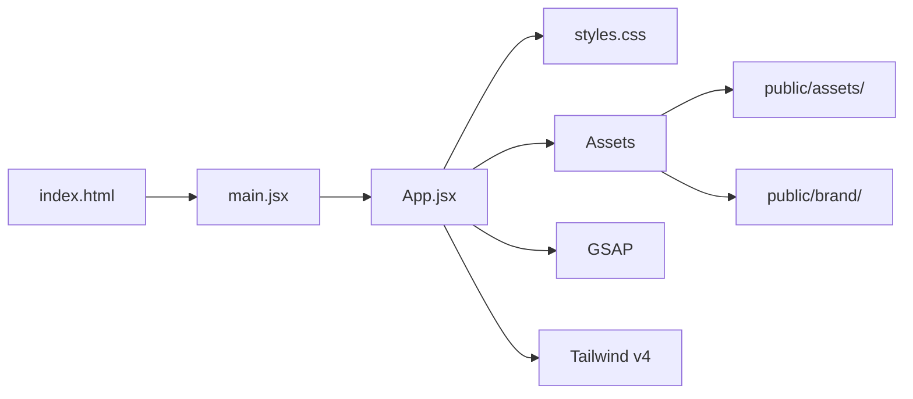

<div align="center">


</div>

<!-- readme-gen:start:badges -->
<p align="center">
  
  
  
  
  
</p>
<!-- readme-gen:end:badges -->

<!-- readme-gen:start:tech-stack -->
<p align="center">
  
</p>
<!-- readme-gen:end:tech-stack -->

<p align="center">
  
  
  
  
</p>


> **One install. Cleaner instructions. Safer search. Explicit routing. Verification-first habits.** Temperance Engine sets the substrate around your local agent work — not the agent itself.


## Highlights

<table>
<tr>
<td width="50%" valign="top">

###  Guarded Templates
Installs NOESIS-style instruction surfaces for Claude, Codex, and OpenCode without copying private memory.

</td>
<td width="50%" valign="top">

###  Backup-First Writes
Copies existing target files into timestamped backups before replacing local runtime configuration.

</td>
</tr>
<tr>
<td width="50%" valign="top">

###  CodeGraph Routing
Routes structural search for `.agents` through a local AST index instead of brittle text search.

</td>
<td width="50%" valign="top">

###  Skill-Cluster Resolver
Keeps startup context lean while preserving explicit discovery of specialized capabilities.

</td>
</tr>
</table>


## Quick Start

```bash
git clone https://github.com/Sheshiyer/temperance_engine_landing_page.git
cd temperance_engine_landing_page
npm install
npm run dev
```

Visit `http://localhost:5173/` — the landing page serves with hot module reload.

### Available Scripts

| Command | Description |
|:--------|:------------|
| `npm run dev` | Start Vite dev server on `0.0.0.0:5173` |
| `npm run build` | Production build to `dist/` |
| `npm run preview` | Preview production build locally |
| `npm test` | Run 44-point page verification check |
| `node scripts/verify-page.mjs` | Run the verification script directly |


## What's Inside

The landing page tells the Temperance Engine product story through three sections:

1. **Runtime** — what the installer sets up (guarded templates, CodeGraph routing, skill-cluster resolver, local phase feedback)
2. **Safety** — why it exists (inspectable scaffolding, no private memory shipped, backup-first writes, rollback posture)
3. **Install** — how to evaluate it (review, dry-run, install, verify, rollback — all documented)

### Visual Features

- Cinematic hero with parallax video and spotlight reveal mask
- GSAP ScrollTrigger animations throughout
- Interactive cursor-trail constellation on the install section
- Typewriter effect for the hero tagline
- Liquid-glass design system with film grain, vignette, and bento grid layouts
- Full responsive breakpoints (1120px / 720px)
- `prefers-reduced-motion` support


## Project Structure

```
 temperance-engine-landing-page
 ├──  src/
 │   ├── App.jsx           # Main application component
 │   ├── main.jsx           # React entry point
 │   └── styles.css         # Tailwind + custom design system (1031 lines)
 ├──  public/
 │   ├── assets/             # 6 generated product images
 │   ├── brand/              # Thoughtseed logo lockup + mark
 │   ├── robots.txt          # SEO crawl directives
 │   └── sitemap.xml         # Canonical URL listing
 ├──  scripts/
 │   └── verify-page.mjs     # 44-point automated QA check
 ├── index.html              # SEO-rich HTML with JSON-LD schema
 ├── vite.config.ts          # Vite + React plugin config
 ├── tailwind.config.js      # Tailwind CSS v4 theme
 ├── postcss.config.js       # Tailwind PostCSS + autoprefixer
 └── package.json
```


## Project Health

<!-- readme-gen:start:health -->
| Category | Status | Score |
|:---------|:------:|------:|
| Tests | ████████████████████ | 100% |
| Type Safety | ████████████░░░░░░░░ | 60% |
| Documentation | ████████████████████ | 100% |
| Responsive Design | ████████████████████ | 100% |
| Accessibility | ██████████████░░░░░░ | 70% |

> **Overall: 86%** — Healthy
<!-- readme-gen:end:health -->

**Test coverage**: 44 verification checks covering file existence, SEO metadata, content assertions, asset integrity, and brand compliance. Run with `npm test`.


## Architecture



The landing page is a single-page React application with no router — all content lives in `App.jsx` as a scrollable document. GSAP handles animation; Tailwind v4 + custom CSS handle the design system through `styles.css`.


## Deployment

This site is configured for **Vercel** deployment. Build output goes to `dist/`:

```bash
npm run build    # produces dist/
npm run preview  # test production build locally
```

The `.vercel/` directory contains the build output configuration.


## Contributing

We welcome contributions! Please see our [Contributing Guide](CONTRIBUTING.md) for details on setup, conventions, and the PR process.

## License

MIT © [Thoughtseed](https://thoughtseed.space)

<!-- readme-gen:start:footer -->
<div align="center">


**Built with  by [Thoughtseed](https://thoughtseed.space)**

</div>
<!-- readme-gen:end:footer -->